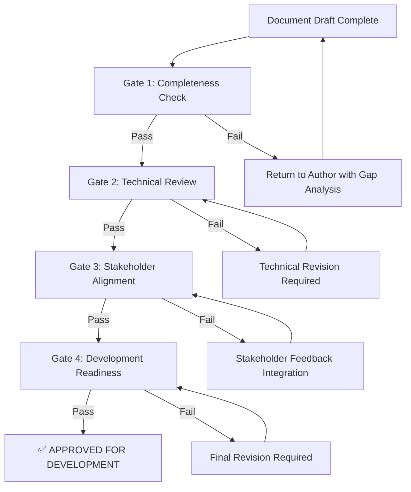

# Document Quality Gates & Review Framework
## SmartWatch Project Process Validation System

**Created:** 2025-08-19 | **BMad Orchestrator**  
**Purpose:** Prevent document quality breakdowns through systematic validation checkpoints

---

## Executive Summary

This framework establishes mandatory quality gates to ensure all project documents meet professional development standards before team handoff. Implements lessons learned from the critical audit findings that revealed fundamental gaps in core planning documents.

**Core Principle:** "No document proceeds to development without passing all quality gates"

---

## Quality Gate Framework

### Gate 1: Document Completeness Validation
**Checkpoint:** Before any document marked "ready for review"

#### Architecture Documents Must Include:
- ✅ Detailed component specifications with interfaces  
- ✅ API contracts with complete data schemas
- ✅ Security implementation details with encryption specifications
- ✅ Build & deployment procedures with step-by-step instructions
- ✅ Testing strategy with coverage targets and frameworks
- ✅ Monitoring & logging approach with specific tools and metrics

#### PRD Documents Must Include:
- ✅ Complete ADHD-Friendly Design Principles (all 5 principles defined)
- ✅ User personas covering target audience segments
- ✅ Success metrics with specific, measurable KPIs
- ✅ Technical constraints and limitations clearly documented
- ✅ Acceptance criteria that are testable with specific parameters
- ✅ Effort estimates, dependencies, and priorities for all epics/stories

### Gate 2: Technical Validation Review
**Checkpoint:** Technical content accuracy and feasibility

#### Mandatory Reviewers:
- **Senior Developer:** Technical implementation feasibility
- **Architect:** System design consistency and scalability  
- **QA Lead:** Testability and acceptance criteria quality
- **Security Specialist:** Security implementation adequacy

#### Validation Criteria:
- All technical specifications are implementable with stated constraints
- Dependencies and integration points clearly identified
- Performance requirements aligned with hardware limitations
- Security measures adequate for data protection requirements

### Gate 3: Stakeholder Alignment Checkpoint
**Checkpoint:** Business and user alignment validation

#### Review Requirements:
- **Product Owner:** Business requirements and user persona alignment
- **UX Designer:** ADHD-friendly design principle compliance
- **Project Manager:** Effort estimates and timeline feasibility
- **Subject Matter Expert:** Domain-specific requirement accuracy

#### Alignment Validation:
- User personas accurately represent target market
- Success metrics align with business objectives
- Design principles support user experience goals
- Project scope achievable within constraints

### Gate 4: Development Readiness Assessment
**Checkpoint:** Final development team handoff approval

#### Readiness Criteria:
- All acceptance criteria are testable by developers
- Technical specifications provide sufficient implementation detail
- Dependencies clearly mapped with mitigation strategies
- Risk factors identified with contingency plans
- Quality standards defined with measurement approaches

---

## Process Implementation

### Document Review Workflow



### Review Timelines
- **Gate 1:** 1 business day (automated + peer review)
- **Gate 2:** 2-3 business days (technical review panel)
- **Gate 3:** 2 business days (stakeholder alignment)
- **Gate 4:** 1 business day (final readiness check)

**Maximum Total Timeline:** 6-7 business days for complete quality gate process

### Escalation Process
- **Gate Failures >2 iterations:** Automatic escalation to Project Manager
- **Timeline Delays >7 days:** Executive sponsor notification
- **Critical Quality Issues:** Immediate hold on development activities

---

## Quality Standards Matrix

### Architecture Document Standards
| Requirement | Minimum Standard | Validation Method |
|-------------|------------------|-------------------|
| Component Interfaces | Complete C++ class definitions | Code compilation test |
| API Specifications | Full JSON schemas with UUIDs | Schema validation tools |
| Security Details | Encryption algorithms specified | Security audit checklist |
| Build Procedures | Step-by-step executable commands | Build automation test |
| Testing Strategy | 90% coverage targets defined | Coverage analysis plan |
| Performance Metrics | Specific timing and resource limits | Benchmarking criteria |

### PRD Document Standards
| Requirement | Minimum Standard | Validation Method |
|-------------|------------------|-------------------|
| Design Principles | All 5 ADHD principles defined | UX expert review |
| User Personas | 3 personas covering full spectrum | Market research validation |
| Success Metrics | Quantifiable KPIs with targets | Analytics implementation plan |
| Acceptance Criteria | Testable with specific parameters | Developer review confirmation |
| Technical Constraints | Hardware/software limitations listed | Technical feasibility assessment |
| Effort Estimates | Story points with confidence levels | Historical velocity comparison |

---

## Tools & Automation

### Automated Quality Checks
```bash
# Document completeness scanner
./scripts/document-quality-check.sh docs/

# Technical specification validator  
./scripts/validate-architecture.sh docs/architecture.md

# PRD requirement completeness
./scripts/validate-prd.sh docs/prd.md
```

### Review Management
- **Tool:** GitHub Issues with quality gate templates
- **Tracking:** Quality gate status dashboard
- **Notifications:** Automated reviewer assignments
- **Escalation:** Timeline tracking with automatic alerts

### Quality Metrics Dashboard
- Gate pass/fail rates by document type
- Average review cycle time by gate
- Most common failure reasons
- Reviewer workload distribution
- Document quality trends over time

---

## Roles & Responsibilities

### Document Authors
- Complete all sections per document template requirements
- Self-validate using provided checklists before Gate 1 submission
- Address reviewer feedback within 48 hours
- Maintain document version control and change logs

### Gate Reviewers
- **Technical Reviewers:** Focus on implementation feasibility and technical accuracy
- **Business Reviewers:** Validate business alignment and user persona accuracy  
- **Quality Reviewers:** Ensure completeness and professional standards
- **Security Reviewers:** Validate security implementation adequacy

### Process Enforcement
- **Project Manager:** Overall quality gate process ownership
- **Quality Assurance:** Gate compliance monitoring and reporting
- **Product Owner:** Final approval authority for business alignment
- **Technical Lead:** Architecture and technical standard enforcement

---

## Continuous Improvement

### Process Refinement Cycle
- **Weekly:** Quality gate metrics review
- **Monthly:** Process effectiveness assessment
- **Quarterly:** Standards update based on lessons learned
- **Annual:** Complete framework review and optimization

### Feedback Integration
- Reviewer feedback on process efficiency
- Author experience with gate requirements
- Development team input on document quality
- Stakeholder satisfaction with delivered documents

### Success Measurement
- **Target:** >95% first-pass gate success rate within 3 months
- **Quality:** Zero critical gaps discovered post-gate approval
- **Efficiency:** <7 day average gate completion time
- **Satisfaction:** >4.5/5.0 process satisfaction from all participants

---

## Emergency Procedures

### Critical Project Situations
- **Production Issues:** Expedited review process with 24-hour gates
- **Customer Escalations:** Executive sponsor direct approval authority
- **Timeline Pressure:** Risk-based gate prioritization with documented trade-offs

### Quality Gate Bypass
- **Authority:** Only Product Owner + Technical Lead joint approval
- **Documentation:** Written justification and risk acceptance
- **Follow-up:** Mandatory post-release quality assessment
- **Learning:** Process improvement recommendations required

---

## Implementation Checklist

### Phase 1: Framework Setup (Week 1)
- [ ] Quality gate templates created
- [ ] Review assignment matrix established  
- [ ] Automated validation scripts developed
- [ ] Review tracking dashboard deployed

### Phase 2: Team Training (Week 2)
- [ ] All team members trained on quality gate process
- [ ] Reviewer responsibilities and standards clarified
- [ ] Document author guidelines distributed
- [ ] Process workflow practiced with sample documents

### Phase 3: Process Enforcement (Week 3+)
- [ ] All new documents subject to quality gates
- [ ] Existing documents reviewed for compliance gaps
- [ ] Process metrics collection initiated
- [ ] Continuous improvement feedback collection started

---

**Document Authority:** BMad Orchestrator  
**Implementation Date:** 2025-08-19  
**Review Cycle:** Monthly effectiveness assessment  
**Success Criteria:** Zero fundamental document gaps in development handoffs