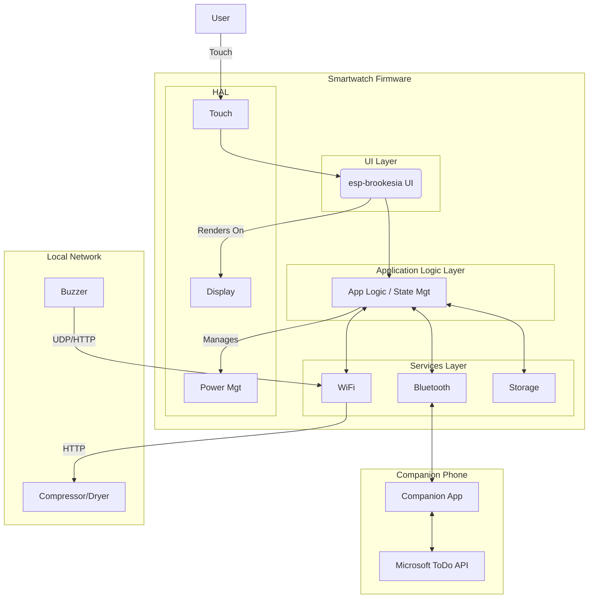

file_content = """
# ESP32-S3 ADHD-Friendly Smartwatch Fullstack Architecture Document

### 1. Introduction
This document outlines the complete fullstack architecture for the ESP32-S3 ADHD-Friendly Smartwatch. It serves as the single source of truth for development. This is a greenfield project built upon the foundational esp-brookesia UI framework.

**Change Log**
| Date | Version | Description | Author |
| :--- | :--- | :--- | :--- |
| 2024-05-24 | 1.0 | Initial Architecture Draft | Winston, Architect |

### 2. High-Level Architecture
The firmware is a **layered monolithic application** running on the ESP32-S3, prioritizing low-power operation and a clear separation of concerns. It manages both Bluetooth and WiFi and relies on a companion phone app as a proxy for internet services.

**Architecture Diagram**

**Architectural Patterns**
*   **Layered Architecture:** Strict separation of HAL, Services, Application Logic, and UI.
*   **Model-View-Controller (MVC) for UI:** Using esp-brookesia to separate UI from application state.
*   **Task-Based Concurrency (RTOS):** Dedicated FreeRTOS tasks for UI, BLE, and WiFi.
*   **Phone-as-Proxy:** The phone handles all complex API interactions to save power and complexity on the watch.

### 3. Tech Stack
| Category | Technology | Version |
| :--- | :--- | :--- |
| **Hardware** | Waveshare ESP32-S3-Touch-LCD-2 | N/A |
| **Framework**| ESP-IDF | v5.1+ |
| **Language** | C++ | 20 |
| **UI Library**| esp-brookesia | latest |
| **RTOS** | FreeRTOS | Bundled |
| **Dev Tools** | VS Code with ESP-IDF Plugin | latest |

### 4. Data Models
*   **`Task`:** `{ id: string, title: string, isComplete: bool }`
*   **`Notification`:** `{ type: enum, sender: string, body: string, timestamp: uint32_t }`
*   **`AppState`:** A single struct containing `currentTaskID`, timer status, and the `notificationQueue`, designed to be serialized to NVS.

### 5. API Specification (BLE Services & Characteristics)
A custom BLE GATT service will be used for communication between the watch and phone.
*   **`TaskData` (Notify):** Phone -> Watch. Sends the serialized JSON list of tasks.
*   **`NotificationData` (Notify):** Phone -> Watch. Sends a new notification.
*   **`Command` (Write):** Watch <-> Phone. Used to trigger actions like `GET_TASKS` or `MARK_COMPLETE`.
*   **`DeviceState` (Read, Notify):** Watch -> Phone. Allows the phone to poll the watch's state (Focus Shield status, battery, etc.).

### 6. Components
*   **HAL:** `DisplayHAL`, `TouchHAL`, `PowerHAL`.
*   **Services:** `BluetoothService`, `WiFiService`, `NvsService`.
*   **Application Logic:** `StateManager` (the "brain").
*   **UI:** `UIManager`, various `Screen` components.

### 7. Core Workflows (Sequence Diagrams)
*   **Starting a Focus Session:** Illustrates the flow from user tap -> HAL -> UI -> StateManager -> Screen render.
*   **Handling a Queued Notification:** Shows the StateManager intercepting a notification from the BluetoothService and queuing it instead of displaying it.
*   **Reviewing Notifications:** Shows the flow of leaving the focus screen, which triggers the UIManager to display queued notifications one by one.

### 8. Database Schema (NVS)
*   **Namespace:** `adhd_watch`
*   **Key:** `app_state`
*   **Type:** Binary Large Object (BLOB)
*   **Strategy:** The entire `AppState` struct is serialized into a single binary blob and saved/loaded atomically by the `NvsService`.

### 9. Unified Project Structure
A standard ESP-IDF project structure will be used, with the `src/` directory organized by architectural layers (`hal/`, `services/`, `app/`, `ui/`). A `common/` directory will hold shared data models.

### 10. Development Workflow
Development will be done in **VS Code with the official ESP-IDF Plugin**, which manages the toolchain, building, flashing, and monitoring of the device. Secrets like WiFi credentials will be provisioned at runtime via a one-time portal, not stored in the repository.

### 11. Security and Performance
*   **Security:** BLE connection will use "Secure Connections" pairing. NVS will be encrypted. OTA updates will be signed and delivered over HTTPS.
*   **Performance:** The primary goal is all-day battery life, achieved through aggressive power management in the `PowerHAL` and a low-power "always-on" mode for the timer. A dedicated, high-priority FreeRTOS task will ensure the UI remains responsive.
"""

with open("architecture.md", "w", encoding="utf-8") as f:
    f.write(file_content)

print("The file 'architecture.md' has been successfully created and is ready for download.")
