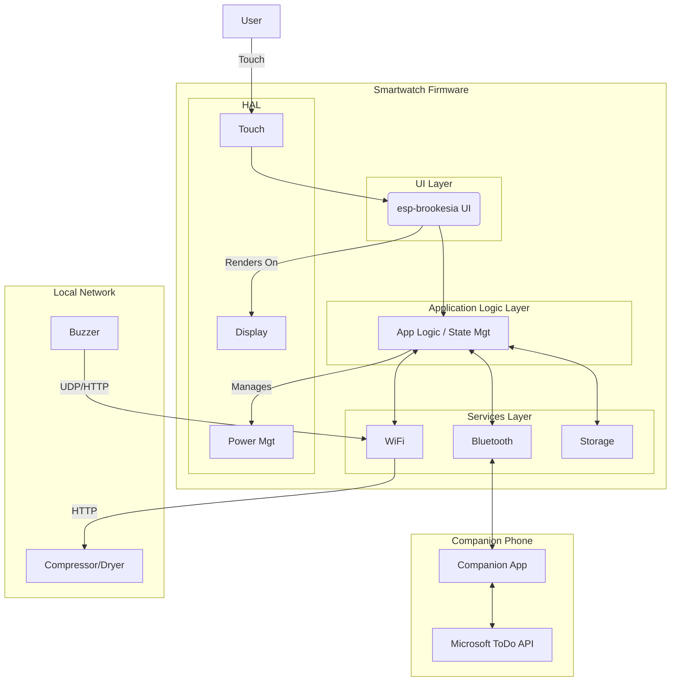

# ESP32-S3 ADHD-Friendly Smartwatch Fullstack Architecture Document

### 1. Introduction
This document outlines the complete fullstack architecture for the ESP32-S3 ADHD-Friendly Smartwatch. It serves as the single source of truth for development. This is a greenfield project built upon the foundational esp-brookesia UI framework.

**Change Log**
| Date | Version | Description | Author |
| :--- | :--- | :--- | :--- |
| 2024-05-24 | 1.0 | Initial Architecture Draft | Winston, Architect |
| 2025-08-19 | 2.0 | Professional Enhancement - Added detailed component specs, API contracts, security implementation, build procedures, testing strategy, and monitoring | BMad Architecture Specialist |

### 2. High-Level Architecture
The firmware is a **layered monolithic application** running on the ESP32-S3, prioritizing low-power operation and a clear separation of concerns. It manages both Bluetooth and WiFi and relies on a companion phone app as a proxy for internet services.

**Architecture Diagram**


**Architectural Patterns**
*   **Layered Architecture:** Strict separation of HAL, Services, Application Logic, and UI.
*   **Model-View-Controller (MVC) for UI:** Using esp-brookesia to separate UI from application state.
*   **Task-Based Concurrency (RTOS):** Dedicated FreeRTOS tasks for UI, BLE, and WiFi.
*   **Phone-as-Proxy:** The phone handles all complex API interactions to save power and complexity on the watch.

### 3. Tech Stack
| Category | Technology | Version |
| :--- | :--- | :--- |
| **Hardware** | Waveshare ESP32-S3-Touch-LCD-2 | N/A |
| **Framework**| ESP-IDF | v5.1+ |
| **Language** | C++ | 20 |
| **UI Library**| esp-brookesia | latest |
| **RTOS** | FreeRTOS | Bundled |
| **Dev Tools** | VS Code with ESP-IDF Plugin | latest |

### 4. Data Models
See Section 5.3 for complete data type definitions. Core models include:
*   **`task_t`:** Task information with priority, due dates, and completion status
*   **`notification_t`:** System and user notifications with priority levels
*   **`app_state_t`:** Complete application state for NVS persistence
*   **`focus_session_t`:** Focus timer session data and progress tracking

### 5. API Specification & Data Schemas

#### 5.1 BLE GATT Service Definition
**Service UUID:** `12345678-1234-5678-9abc-123456789abc`
**Service Name:** ADHD Watch Communication Service

#### 5.2 BLE Characteristics Specification

**`TaskData` Characteristic (Notify)**
- **UUID:** `12345678-1234-5678-9abc-123456789abd`
- **Direction:** Phone → Watch
- **Properties:** Notify
- **Max Size:** 512 bytes
- **Data Format:**
```json
{
  "tasks": [
    {
      "id": "string",
      "title": "string", 
      "isComplete": boolean,
      "priority": "high|medium|low",
      "dueDate": "ISO8601 timestamp",
      "estimatedMinutes": integer
    }
  ],
  "timestamp": "ISO8601 timestamp",
  "version": integer
}
```

**`NotificationData` Characteristic (Notify)**
- **UUID:** `12345678-1234-5678-9abc-123456789abe`
- **Direction:** Phone → Watch  
- **Properties:** Notify
- **Max Size:** 256 bytes
- **Data Format:**
```json
{
  "id": "string",
  "type": "task_reminder|meeting|message|system",
  "sender": "string",
  "body": "string",
  "timestamp": "ISO8601 timestamp",
  "priority": "high|medium|low",
  "actionRequired": boolean
}
```

**`Command` Characteristic (Write)**
- **UUID:** `12345678-1234-5678-9abc-123456789abf`
- **Direction:** Watch ↔ Phone
- **Properties:** Write, Write Without Response
- **Max Size:** 128 bytes
- **Command Format:**
```json
{
  "command": "GET_TASKS|MARK_COMPLETE|START_FOCUS|END_FOCUS|SYNC_TIME",
  "parameters": {
    "taskId": "string",
    "timestamp": "ISO8601 timestamp"
  },
  "requestId": "string"
}
```

**`DeviceState` Characteristic (Read/Notify)**
- **UUID:** `12345678-1234-5678-9abc-123456789abg`
- **Direction:** Watch → Phone
- **Properties:** Read, Notify
- **Max Size:** 256 bytes
- **State Format:**
```json
{
  "batteryLevel": integer,
  "isCharging": boolean,
  "focusMode": {
    "isActive": boolean,
    "currentTaskId": "string",
    "remainingMinutes": integer
  },
  "displayState": "on|dimmed|off",
  "lastSync": "ISO8601 timestamp",
  "firmwareVersion": "string",
  "uptimeSeconds": integer
}
```

#### 5.3 Data Type Definitions
```cpp
// Core data structures used throughout the system
struct task_t {
    std::string id;
    std::string title;
    bool is_complete;
    priority_level_t priority;
    uint64_t due_date_unix;
    uint16_t estimated_minutes;
};

struct notification_t {
    std::string id;
    notification_type_t type;
    std::string sender;
    std::string body;
    uint64_t timestamp_unix;
    priority_level_t priority;
    bool action_required;
};

struct app_state_t {
    std::string current_task_id;
    std::queue<notification_t> notification_queue;
    focus_session_t focus_session;
    uint64_t last_sync_timestamp;
    battery_status_t battery_status;
    display_state_t display_state;
};

struct focus_session_t {
    bool is_active;
    std::string task_id;
    uint64_t start_time_unix;
    uint16_t duration_minutes;
    uint16_t remaining_minutes;
};
```

### 6. Component Specifications & Interfaces

#### 6.1 Hardware Abstraction Layer (HAL)

**`DisplayHAL`**
```cpp
class DisplayHAL {
public:
    esp_err_t init(int brightness = 80);
    esp_err_t set_brightness(uint8_t level);
    esp_err_t render_buffer(const uint16_t* framebuffer);
    esp_err_t enter_sleep_mode();
    esp_err_t wake_from_sleep();
    display_info_t get_display_info();
private:
    SemaphoreHandle_t display_mutex;
    bool is_initialized;
};
```
- **Responsibility:** Abstract LCD display operations
- **Dependencies:** ESP-IDF display drivers, FreeRTOS
- **Power Management:** Supports sleep/wake cycles for battery optimization

**`TouchHAL`**
```cpp
class TouchHAL {
public:
    esp_err_t init(touch_callback_t callback);
    esp_err_t calibrate();
    touch_point_t get_touch_coordinates();
    esp_err_t enable_interrupt();
    esp_err_t disable_interrupt();
private:
    QueueHandle_t touch_event_queue;
    touch_callback_t user_callback;
};
```
- **Responsibility:** Handle touch screen interactions
- **Dependencies:** Touch controller drivers, interrupt handlers
- **Interface:** Callback-based event system for UI responsiveness

**`PowerHAL`**
```cpp
class PowerHAL {
public:
    esp_err_t init();
    battery_status_t get_battery_status();
    esp_err_t enter_deep_sleep(uint64_t sleep_time_us);
    esp_err_t enable_light_sleep();
    esp_err_t set_cpu_frequency(uint32_t freq_mhz);
    power_profile_t get_current_profile();
private:
    adc_handle_t battery_adc;
    power_profile_t active_profile;
};
```
- **Responsibility:** Power management and battery monitoring
- **Dependencies:** ADC drivers, RTC, power management unit
- **Features:** Multi-level power profiles (active, idle, deep sleep)

#### 6.2 Services Layer

**`BluetoothService`**
```cpp
class BluetoothService {
public:
    esp_err_t init(ble_event_callback_t callback);
    esp_err_t start_advertising();
    esp_err_t stop_advertising();
    esp_err_t send_notification(const ble_characteristic_t& char_id, 
                               const uint8_t* data, size_t length);
    esp_err_t register_characteristic(const ble_char_config_t& config);
    connection_status_t get_connection_status();
private:
    TaskHandle_t ble_task_handle;
    ble_event_callback_t event_callback;
    std::vector<ble_char_config_t> registered_characteristics;
};
```
- **Responsibility:** BLE GATT server management and communication
- **Dependencies:** ESP-IDF BLE stack, NimBLE
- **Security:** Implements BLE Secure Connections pairing

**`WiFiService`**
```cpp
class WiFiService {
public:
    esp_err_t init(wifi_event_callback_t callback);
    esp_err_t connect(const char* ssid, const char* password);
    esp_err_t disconnect();
    esp_err_t start_provisioning_portal();
    wifi_status_t get_connection_status();
    esp_err_t send_http_request(const http_request_t& request, 
                               http_response_t& response);
private:
    wifi_event_callback_t event_callback;
    httpd_handle_t provisioning_server;
};
```
- **Responsibility:** WiFi connectivity and HTTP client operations
- **Dependencies:** ESP-IDF WiFi stack, HTTP client
- **Features:** Runtime provisioning portal for credentials

**`NvsService`**
```cpp
class NvsService {
public:
    esp_err_t init(const char* namespace_name);
    esp_err_t save_blob(const char* key, const void* data, size_t length);
    esp_err_t load_blob(const char* key, void* data, size_t* length);
    esp_err_t erase_key(const char* key);
    esp_err_t erase_namespace();
    size_t get_used_space();
private:
    nvs_handle_t nvs_handle;
    std::string namespace_name;
    SemaphoreHandle_t nvs_mutex;
};
```
- **Responsibility:** Non-volatile storage with encryption
- **Dependencies:** ESP-IDF NVS library, encryption keys
- **Security:** All data encrypted at rest

#### 6.3 Application Logic Layer

**`StateManager`**
```cpp
class StateManager {
public:
    esp_err_t init(const state_callbacks_t& callbacks);
    esp_err_t load_state_from_nvs();
    esp_err_t save_state_to_nvs();
    esp_err_t handle_task_update(const task_list_t& tasks);
    esp_err_t handle_notification(const notification_t& notification);
    esp_err_t start_focus_session(const std::string& task_id);
    esp_err_t end_focus_session();
    app_state_t get_current_state() const;
private:
    app_state_t current_state;
    std::queue<notification_t> notification_queue;
    TimerHandle_t focus_timer;
    state_callbacks_t callbacks;
};
```
- **Responsibility:** Central state management and business logic
- **Dependencies:** All services, NVS, FreeRTOS timers
- **Patterns:** Observer pattern for state change notifications

#### 6.4 UI Layer

**`UIManager`**
```cpp
class UIManager {
public:
    esp_err_t init(ui_event_callback_t callback);
    esp_err_t show_screen(screen_type_t screen_type);
    esp_err_t update_screen_data(const screen_data_t& data);
    esp_err_t handle_touch_event(const touch_event_t& event);
    screen_type_t get_current_screen();
    esp_err_t show_notification(const notification_t& notification);
private:
    std::unique_ptr<BaseScreen> current_screen;
    ui_event_callback_t event_callback;
    std::map<screen_type_t, std::unique_ptr<BaseScreen>> screen_registry;
};
```
- **Responsibility:** UI state management and screen coordination
- **Dependencies:** esp-brookesia, HAL components
- **Pattern:** Screen-based navigation with centralized management

### 7. Core Workflows (Sequence Diagrams)
*   **Starting a Focus Session:** Illustrates the flow from user tap -> HAL -> UI -> StateManager -> Screen render.
*   **Handling a Queued Notification:** Shows the StateManager intercepting a notification from the BluetoothService and queuing it instead of displaying it.
*   **Reviewing Notifications:** Shows the flow of leaving the focus screen, which triggers the UIManager to display queued notifications one by one.

### 8. Database Schema (NVS)
*   **Namespace:** `adhd_watch`
*   **Key:** `app_state`
*   **Type:** Binary Large Object (BLOB)
*   **Strategy:** The entire `AppState` struct is serialized into a single binary blob and saved/loaded atomically by the `NvsService`.

### 9. Unified Project Structure
A standard ESP-IDF project structure will be used, with the `src/` directory organized by architectural layers (`hal/`, `services/`, `app/`, `ui/`). A `common/` directory will hold shared data models.

### 10. Development Workflow
Development will be done in **VS Code with the official ESP-IDF Plugin**, which manages the toolchain, building, flashing, and monitoring of the device. Secrets like WiFi credentials will be provisioned at runtime via a one-time portal, not stored in the repository.

### 11. Security Implementation

#### 11.1 BLE Security
**Pairing & Authentication:**
- **Method:** BLE Secure Connections with Numeric Comparison
- **Encryption:** AES-128 CCM mode for all characteristics
- **Key Management:** Bonding keys stored in encrypted NVS
- **Authentication:** Mutual authentication required before data exchange

**Implementation:**
```cpp
// BLE security configuration
ble_security_config_t security_config = {
    .auth_req = BLE_SM_PAIR_AUTHREQ_SC | BLE_SM_PAIR_AUTHREQ_MITM,
    .io_cap = BLE_SM_IO_CAP_DISP_YES_NO,
    .key_size = 16,
    .init_key = BLE_SM_PAIR_KEY_DIST_ENC | BLE_SM_PAIR_KEY_DIST_ID,
    .resp_key = BLE_SM_PAIR_KEY_DIST_ENC | BLE_SM_PAIR_KEY_DIST_ID
};
```

#### 11.2 Data Protection
**NVS Encryption:**
- **Algorithm:** AES-256 XTS mode
- **Key Source:** Hardware security module (efuse)
- **Namespace Isolation:** Separate encrypted partitions per service

**Sensitive Data Handling:**
```cpp
// Example secure storage implementation
class SecureStorage {
public:
    esp_err_t store_encrypted(const char* key, const void* data, size_t len);
    esp_err_t retrieve_encrypted(const char* key, void* data, size_t* len);
private:
    mbedtls_aes_context aes_ctx;
    uint8_t encryption_key[32];
};
```

#### 11.3 OTA Security
**Signed Updates:**
- **Algorithm:** RSA-2048 with SHA-256
- **Verification:** Bootloader validates signature before installation
- **Rollback Protection:** Version number enforcement
- **Secure Boot:** Enabled with hardware-rooted trust

### 12. Build & Deployment Procedures

#### 12.1 Development Environment Setup
**Prerequisites:**
```bash
# Install ESP-IDF v5.1+
git clone --recursive https://github.com/espressif/esp-idf.git
cd esp-idf && ./install.sh
source ./export.sh

# Install additional dependencies
pip install esptool cryptography
```

**Project Configuration:**
```bash
# Initial setup
idf.py set-target esp32s3
idf.py menuconfig
# Configure: WiFi, Bluetooth, NVS encryption, Secure Boot
```

#### 12.2 Build Process
**Development Build:**
```bash
# Build firmware
idf.py build

# Flash to device
idf.py -p /dev/ttyUSB0 flash monitor
```

**Production Build:**
```bash
# Generate signing keys (one-time)
espsecure.py generate_signing_key --version 2 secure_boot_signing_key.pem

# Production build with security
idf.py build
espsecure.py sign_data --keyfile secure_boot_signing_key.pem --output signed_firmware.bin build/smartwatch.bin
```

#### 12.3 Quality Gates
**Pre-Deployment Checklist:**
- ✅ All unit tests pass (>90% coverage)
- ✅ Integration tests pass on target hardware
- ✅ Security scan complete (no critical vulnerabilities)
- ✅ Power consumption test (<20mA average)
- ✅ BLE interoperability test with companion app
- ✅ OTA update test successful
- ✅ Code review approved by 2+ engineers

### 13. Testing Strategy

#### 13.1 Unit Testing
**Framework:** Unity test framework (included with ESP-IDF)
**Coverage Target:** 90% line coverage minimum

**Test Structure:**
```cpp
// Example unit test
TEST_CASE("StateManager handles task completion correctly", "[state_manager]") {
    StateManager state_manager;
    state_manager.init(test_callbacks);
    
    // Test task completion flow
    task_t test_task = {"task-123", "Test Task", false, PRIORITY_HIGH, 0, 30};
    TEST_ASSERT_EQUAL(ESP_OK, state_manager.handle_task_update({test_task}));
    TEST_ASSERT_FALSE(state_manager.get_current_state().current_task_id.empty());
}
```

**Automated Testing:**
```bash
# Run unit tests
idf.py build
cd build && make test
```

#### 13.2 Integration Testing
**Target Hardware:** Waveshare ESP32-S3-Touch-LCD-2
**Test Categories:**
- BLE communication with mock companion app
- Power management state transitions
- Touch screen responsiveness under load
- NVS persistence across power cycles
- WiFi provisioning and HTTP requests

#### 13.3 System Testing
**End-to-End Scenarios:**
1. **Complete User Journey:** Setup → Task sync → Focus session → Notification handling
2. **Power Cycle Recovery:** State persistence across unexpected reboots
3. **Network Resilience:** BLE/WiFi connection recovery after network issues
4. **Performance Under Load:** Response time with maximum notification queue

### 14. Monitoring & Logging

#### 14.1 Logging Framework
**ESP-IDF Logging System:**
```cpp
// Logging levels per component
#define TAG "StateManager"
ESP_LOGI(TAG, "Focus session started for task: %s", task_id.c_str());
ESP_LOGW(TAG, "Battery level low: %d%%", battery_level);
ESP_LOGE(TAG, "BLE connection failed: %s", esp_err_to_name(err));
```

**Production Logging Configuration:**
- **Error Level:** Always logged to NVS for crash analysis
- **Warning Level:** Logged with rotation (max 10KB)
- **Info Level:** Debug builds only
- **Debug/Verbose:** Disabled in production

#### 14.2 Health Monitoring
**Metrics Collection:**
- Battery level and charging state
- BLE connection stability (RSSI, disconnect count)
- WiFi signal strength and connection time
- Memory usage (heap, stack high water mark)
- Task execution timing and watchdog resets

**Diagnostic Interface:**
```cpp
// System health snapshot
struct system_health_t {
    uint8_t battery_level;
    int8_t ble_rssi;
    uint32_t free_heap;
    uint32_t uptime_seconds;
    uint32_t reset_count;
    esp_reset_reason_t last_reset_reason;
};
```

#### 14.3 Remote Diagnostics
**Companion App Integration:**
- Real-time system health data via BLE
- Log extraction for customer support
- Remote configuration updates
- Performance metrics dashboard

### 15. Performance Optimization

#### 15.1 Power Management Strategy
**Target:** 24+ hour battery life with typical usage

**Power Profiles:**
- **Active Mode (80-240MHz):** UI interactions, BLE active communication
- **Idle Mode (10-80MHz):** Background processing, periodic sync
- **Light Sleep (32kHz):** Display off, BLE advertising only
- **Deep Sleep:** Complete shutdown except RTC, wake on timer/touch

**Implementation:**
```cpp
// Adaptive power management
void PowerHAL::optimize_for_activity(activity_type_t activity) {
    switch(activity) {
        case ACTIVITY_UI_INTERACTION:
            set_cpu_frequency(240); // Max performance
            break;
        case ACTIVITY_BLE_SYNC:
            set_cpu_frequency(80);  // Balanced
            break;
        case ACTIVITY_IDLE:
            enable_light_sleep();   // Power saving
            break;
    }
}
```

#### 15.2 Memory Optimization
**Heap Management:**
- Static allocation for critical paths
- Memory pools for frequent allocations/deallocations
- Stack size optimization per task

**Flash Usage:**
- Code partitioning with lazy loading
- Compression for non-critical assets
- OTA partition size optimization

#### 15.3 Real-Time Performance
**FreeRTOS Task Priorities:**
- **Priority 5 (Highest):** Touch interrupt handling, display refresh
- **Priority 4:** BLE communication, critical timers  
- **Priority 3:** Application logic, state management
- **Priority 2:** WiFi operations, background sync
- **Priority 1 (Lowest):** Logging, diagnostics